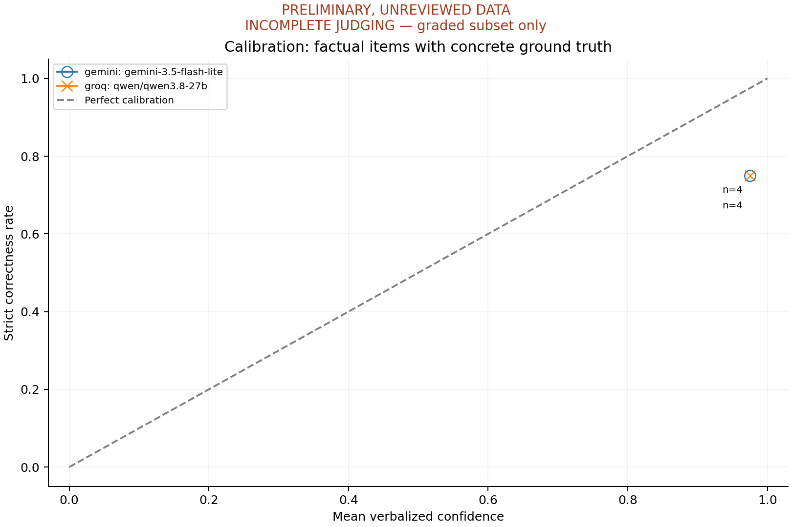
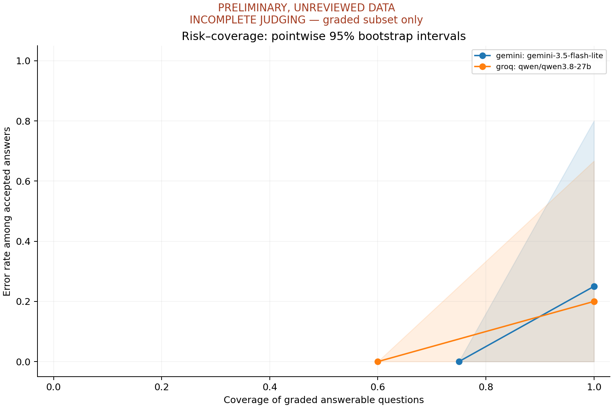

# Bangla-Cal evaluation report

**PRELIMINARY, UNREVIEWED DATA**

**INCOMPLETE JUDGING. Metrics below use only the graded subset.**
Missing grades follow run order, not random sampling; do not rank models using these estimates.
27 of 48 response grades remain pending.
Recorded grading errors and their actual quota details are preserved in metrics.json and the raw run directories.

This is a pipeline dry run, not a validated benchmark finding. Dataset review and
judge/human validation status below control how these numbers may be interpreted.

## Run provenance

- **gemini / gemini-3.5-flash-lite**: 24 responses; 24 with both confidence methods; 0 responses with parse errors; 15 ungraded.
  Exact returned version(s): gemini-3.5-flash-lite.
  Started 2026-09-11T07:23:23.093899+00:00; code 985c5c3bf6f78f09012efd97a76ac6336c57f7d8.
  Dataset hash: `2ec218415d4cf4efd673c50377f50a015e97ca87eb1cd42feafc9eb8d3955d46`.
  Separate judge: gemini-3.5-flash.
- **groq / qwen/qwen3.8-27b**: 24 responses; 24 with both confidence methods; 0 responses with parse errors; 12 ungraded.
  Exact returned version(s): qwen/qwen3.8-27b.
  Started 2026-09-11T07:23:24.636127+00:00; code 985c5c3bf6f78f09012efd97a76ac6336c57f7d8.
  Dataset hash: `2ec218415d4cf4efd673c50377f50a015e97ca87eb1cd42feafc9eb8d3955d46`.
  Separate judge: gemini-3.5-flash.

## Overall estimates

Values are estimates [95% bootstrap interval]. Lower ECE, Brier and
hallucination rate are better. Precision and recall have different denominators.

| Model | ECE | Brier | Hallucination rate | Abstention precision | Abstention recall (cat. 5) |
| --- | --- | --- | --- | --- | --- |
| gemini/gemini-3.5-flash-lite | 0.225 [0.000, 0.720] | 0.203 [0.000, 0.648] | 0.000 [0.000, 0.000] | 0.500 [0.000, 1.000] | 1.000 [1.000, 1.000] |
| groq/qwen/qwen3.8-27b | 0.225 [0.000, 0.755] | 0.226 [0.000, 0.722] | 0.000 [0.000, 0.000] | 0.600 [0.000, 1.000] | 1.000 [1.000, 1.000] |

## Category estimates

| Model | Category | Scored | Calibration n | ECE | Hallucination rate |
| --- | --- | --- | --- | --- | --- |
| gemini/gemini-3.5-flash-lite | ambiguous_contested | 1 | 0 | unavailable | unavailable |
| gemini/gemini-3.5-flash-lite | code_switched | 1 | 0 | unavailable | unavailable |
| gemini/gemini-3.5-flash-lite | factual_high_certainty | 2 | 2 | 0.000 [0.000, 0.000] | unavailable |
| gemini/gemini-3.5-flash-lite | factual_low_resource | 2 | 2 | 0.450 [0.000, 0.900] | unavailable |
| gemini/gemini-3.5-flash-lite | temporally_unstable | 2 | 0 | unavailable | unavailable |
| gemini/gemini-3.5-flash-lite | unanswerable_adversarial | 1 | 0 | unavailable | 0.000 [0.000, 0.000] |
| groq/qwen/qwen3.8-27b | ambiguous_contested | 2 | 0 | unavailable | unavailable |
| groq/qwen/qwen3.8-27b | code_switched | 2 | 0 | unavailable | unavailable |
| groq/qwen/qwen3.8-27b | factual_high_certainty | 2 | 2 | 0.000 [0.000, 0.000] | unavailable |
| groq/qwen/qwen3.8-27b | factual_low_resource | 2 | 2 | 0.450 [0.050, 0.950] | unavailable |
| groq/qwen/qwen3.8-27b | temporally_unstable | 2 | 0 | unavailable | unavailable |
| groq/qwen/qwen3.8-27b | unanswerable_adversarial | 2 | 0 | unavailable | 0.000 [0.000, 0.000] |

Full per-category Brier, sampling-confidence metrics, behavioral scores, sensitivities,
denominators and defined/undefined bootstrap counts are in [metrics.csv](metrics.csv)
and [metrics.json](metrics.json).

## Confidence-method cross-check

| Model | Verbalized ECE | Sampling ECE | Sampling Brier |
| --- | --- | --- | --- |
| gemini/gemini-3.5-flash-lite | 0.225 [0.000, 0.720] | 0.083 [0.000, 0.267] | 0.028 [0.000, 0.089] |
| groq/qwen/qwen3.8-27b | 0.225 [0.000, 0.755] | 0.167 [0.000, 0.333] | 0.056 [0.000, 0.111] |

## Judge/human agreement

| Evaluated model | Validation status | Human graded / queued | Random pairs / selected | Exact grade agreement |
| --- | --- | --- | --- | --- |
| gemini/gemini-3.5-flash-lite | PENDING HUMAN VALIDATION | 0/20 | 0/3 | unavailable |
| groq/qwen/qwen3.8-27b | PENDING HUMAN VALIDATION | 0/19 | 0/3 | unavailable |

Missing human grades mean agreement is **unavailable**, not zero and not perfect.
Queues preserve blinded first-pass decisions. Any low agreement requires expanded human
grading; human overrides do not alter the original judge agreement calculation.

## Methodology and limitations

- Question-level percentile bootstrap, 95% intervals, 2000 resamples, seed 42.
- Ten equal-width ECE bins; 5/15-bin sensitivity included. Strict correctness treats partial as zero.
- ECE/Brier use categories 1–3 with concrete ground truth. Null temporal answers are excluded.
- Risk–coverage includes all graded answerable questions (including answerable code switching),
  excludes actual abstention from acceptance, and includes equal-confidence answers together.
  Its shaded intervals are pointwise at fixed thresholds; they are not simultaneous bands.
- Hallucination uses category 5, a specific unfounded assertion, no abstention, and >=0.8
  verbalized confidence or explicit certainty in prose. Threshold sensitivity is provided.
- Sampling agreement compares each sample to the primary answer after conservative text
  normalization; paraphrases may be undercounted. It is a proxy, not semantic certainty.
- Every run's sample count and temperatures are in metrics.json. Smoke uses three samples
  at temperature 0.7; normal runs default to ten. Primary temperature is zero.
- Raw token logprobs, where available, are retained separately. No whole-response token
  likelihood is presented as probability of factual correctness.
- Tiny category counts and unreviewed items limit inference. Degenerate bootstrap intervals
  from all-correct/all-wrong small samples do not establish certainty. Undefined resamples
  are counted, and intervals are conditional on estimable bootstrap samples.
- Scores are provisional wherever the human-validation gate is pending. A Gemini judge
  may favor related model outputs. Do not interpret differences as validated model rankings.
- Standard/formal Bengali only, plus deliberate code switching; dialects are not covered.
  The first batch is heritage-heavy and does not establish broad Bangladesh-domain coverage.
- API models can change; retain exact returned versions, timestamps, raw logs and dataset hashes.
  A returned model identifier may still be a mutable alias; no immutable snapshot is inferred.
- No English comparison experiment was run. No cross-language gap or novelty claim is inferred.
- All categories are reported, including unavailable and null/negative findings. This pilot
  establishes pipeline behavior only; no robust category effect is claimed.

Evaluated against freely accessible models only; proprietary frontier models (GPT, Claude)
excluded from v1 due to cost, left as future work pending research credits or sponsorship.
Ollama is implemented but not evaluated in this cloud smoke test. Encoder-only Bengali
models are not treated as comparable generative QA systems.

## Before a research release

Expand the draft toward 400–600 questions, recruit a second native Bengali reviewer,
obtain two independent item reviews, archive temporal sources, freeze the dataset, run
full evaluations, complete and adjudicate human grades, then regenerate the report.
